### Create GCP instance

**1) Access a GCP project and give every team member access**

Provide a ``@gmail.com`` email address via the assignment on Blackboard. This account will be added to a GCP project that you can find via the console: https://console.cloud.google.com/.

Before continuing, add your team members to this project through the ``IAM & Admin > IAM`` menu.

**2) Create a Compute instance (VM)**

Search for ``Compute Engine``. If this is the first time in the project, the Compute Engine API will be disabled and you see the following screen:

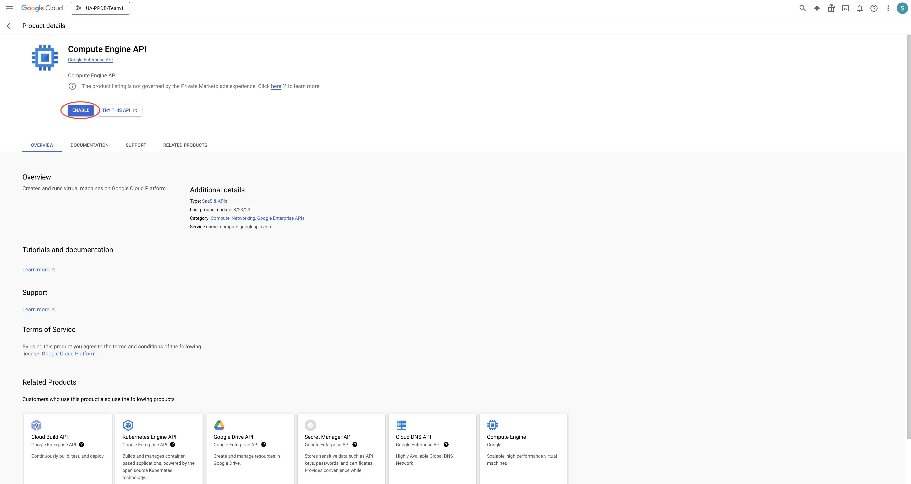

Just press the enable. This will create a pop up saying that a billing account is required. Click ``enable``. A prompt will appear asking which billing account. This is the code you received from the assistant. Configure the billing and click on ``set account``. If all goes well you will see the following:

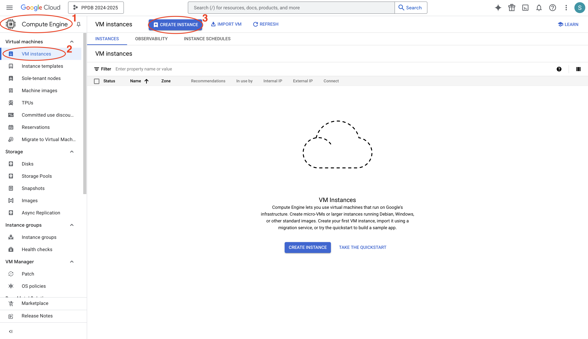

Now we will create a Virtual Machine (VM) instance. Follow the steps on the figure above. This will create a new screen:

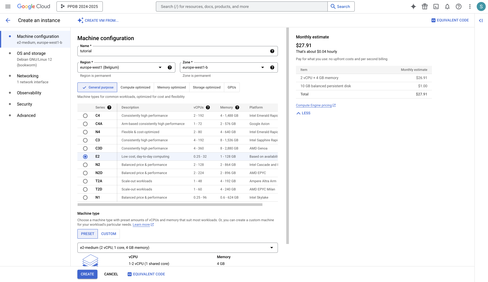

Give the VM instance a name (this can't be changed later). Set ``Region`` to ``europe-west1 (Belgium)``, ``Zone`` to ``europe-west1-b``, and choose the E2 machine type series. You can choose other options but be aware of the costs that they do not exceed beyond the given credits untill the defendence of the project. When all this is done, go the the OS and storage section.

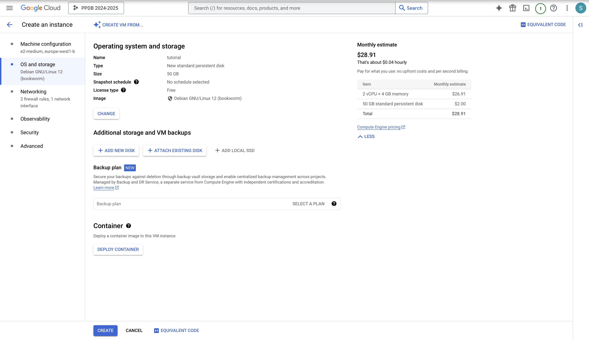

Press ``change`` and change the ``Type``to ``New standard persistent disk`` and ``Size`` to ``50 GB``. Then go to the ``Networking``section:

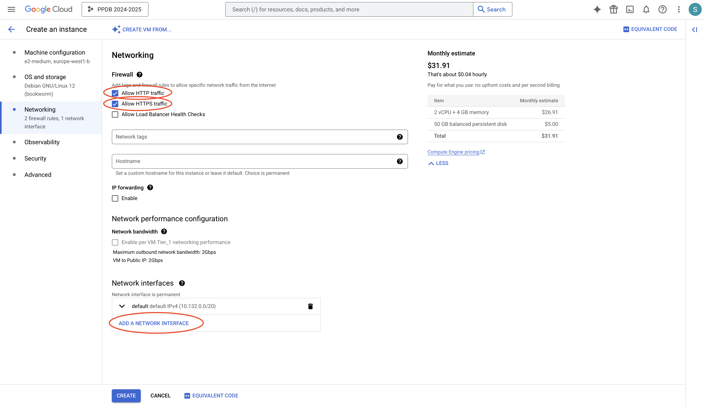
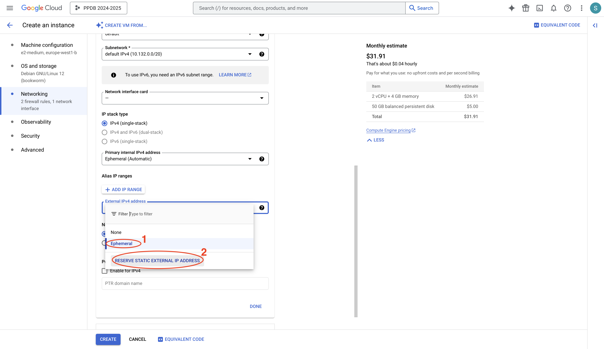

Turn on ``Allow HTTP traffic``, ``Allow HTTPS traffic`` and add a new network interface as in the picture above. Upon reserving a static external IP address, a popup appears to give it a name. Give it a name (does not need to be the same as the picture) and press ``Reserve``:

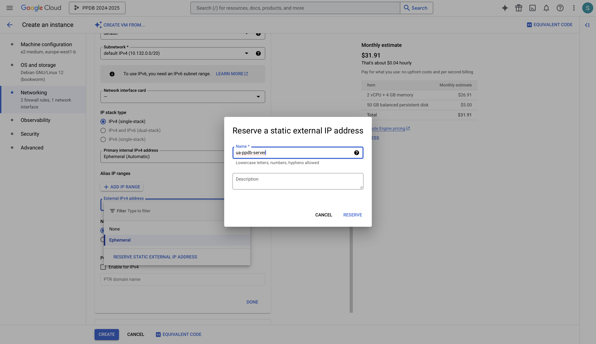
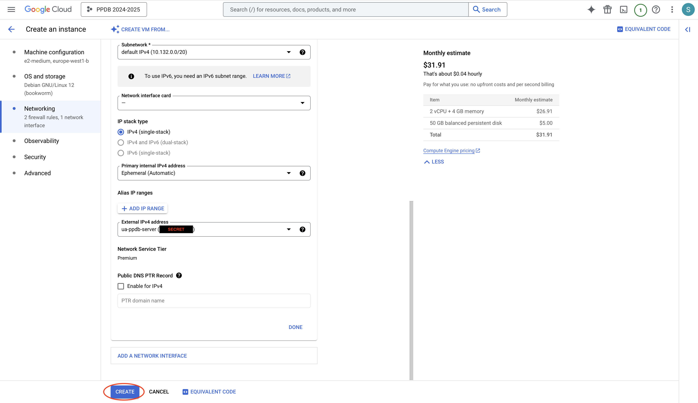

The external IPv4 address should be visible now. Finally, click ``Create`` to create the VM instance. In the list of VM instances, a new VM instance with your provided name should be visible.

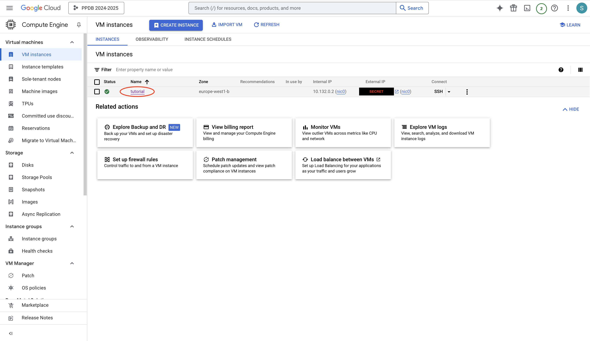

**3) (Optional) Set static IP address and add Firewall rule**
If you forgot to set the static IP address, you can still edit this after the instance is created. Additionally, a firewall rule to allow traffic on specific ports can be added (if you forgot to check http/https traffic earlier or want to add access the debug server). Click on the name of the VM instance (see picture above). This will lead you to ``Detail`` section. Scroll down untill ``Network interfaces`` and click on ``View Details``

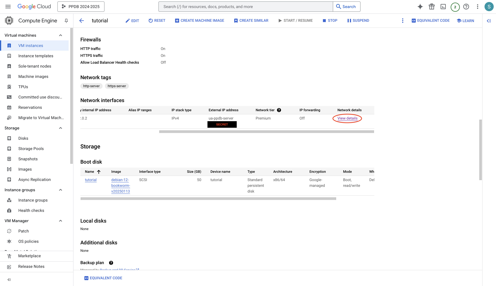
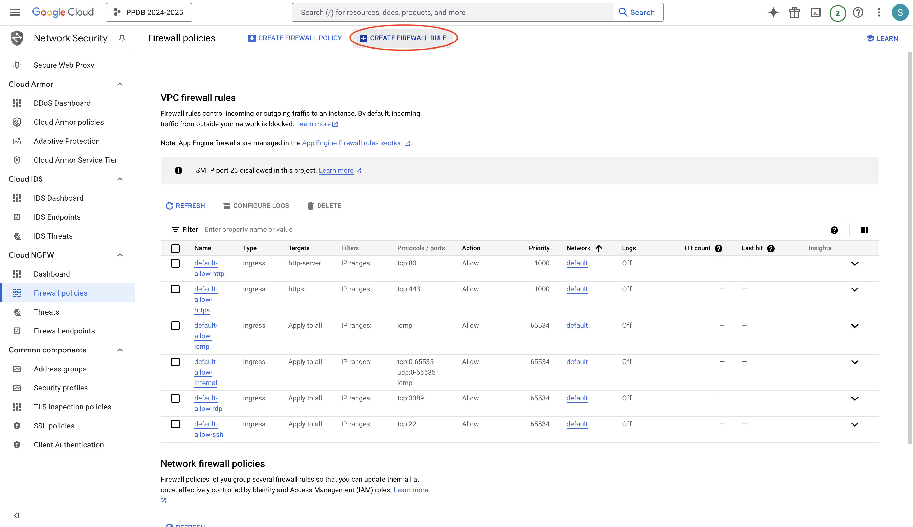

Now you can create a firewall rule. Specify the following options:

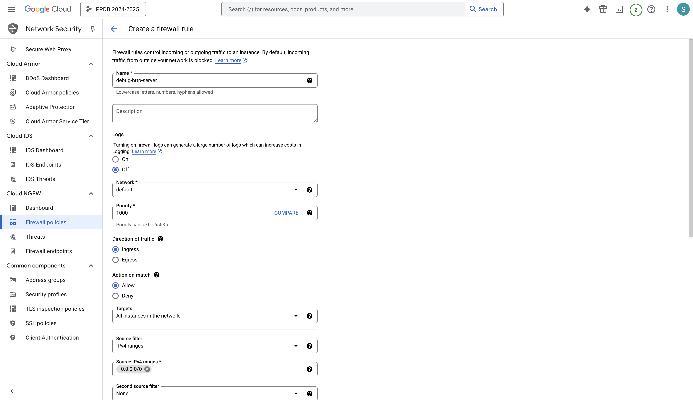
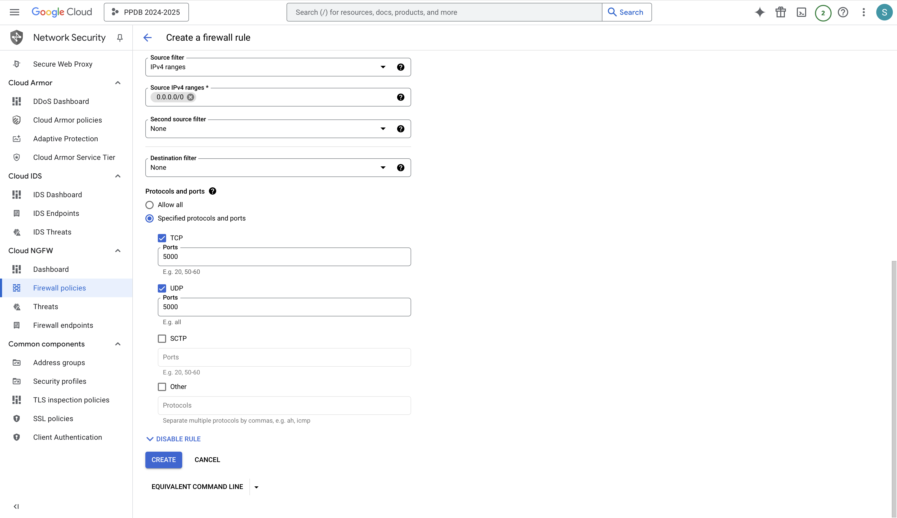

**4) Add SSH keys**
In the VM settings, you can add SSH keys img13
for each team member. If you don't know how to create this, go to the following file:

(link to new markdown)

Copy the contents of your public SSH key, for example ``~/.ssh/id_rsa.pub``, to the VM instance. Go to the VM instance and click on ``Details``:

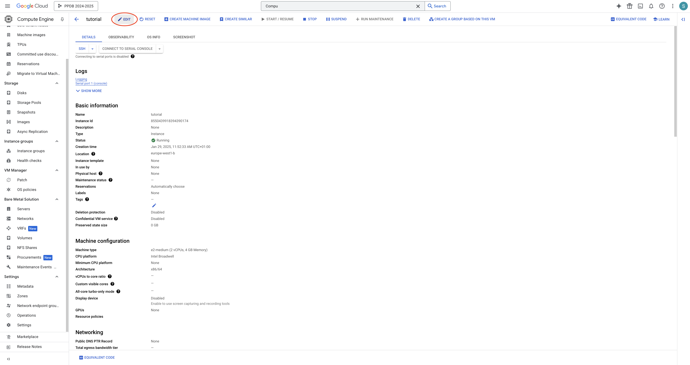
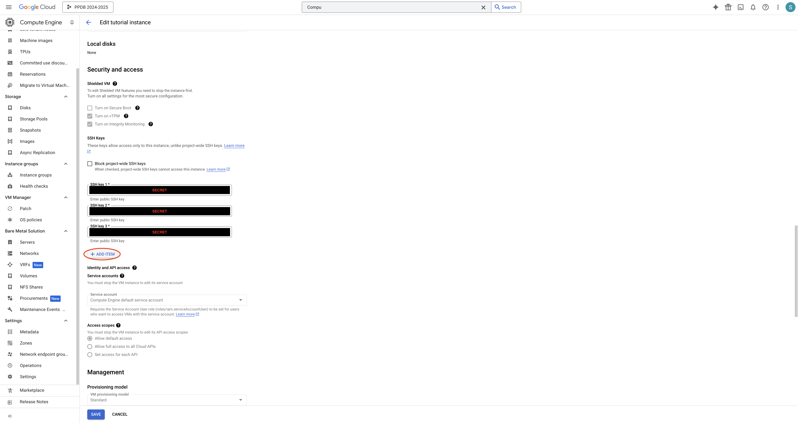

A new field appears, fill in the public key.
