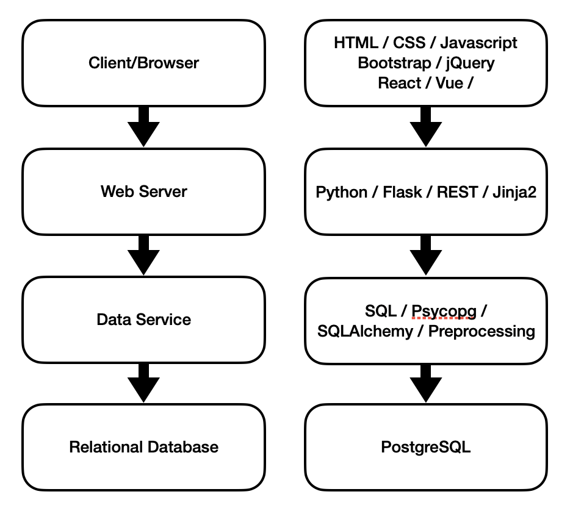

# Project Features

This template provides a solid foundation to kickstart your project with a range of useful features. It remains flexible, allowing you to choose and customize the components that best suit your needs. This project depends on the following technologies:

## Relational Database

- **PostgreSQL**  
    Robust and efficient database management with PostgreSQL. 
    [Documentation](https://www.postgresql.org/docs/current/)

## Data Service

- **SQL** 
    Standard Query Language for managing and interacting with relational databases.  

- **Psycopg**
    PostgreSQL database adapter for Python, enabling database connectivity. Mainly used for SQLAlchemy.
    [Documentation](https://www.psycopg.org/docs/)

- **SQLAlchemy**  
    The Python SQL toolkit and Object Relational Mapper that gives application developers the full power and flexibility of SQL.
    [Documentation](https://docs.sqlalchemy.org/en/20/)

## Web Server

- **Python**  

- **Flask-Based API**  
    A lightweight and scalable web API built with Flask.  
    [Documentation](https://flask.palletsprojects.com/en/stable/)

- **REST** 
    Imposes conditions on how an API should work.
    [Info](https://aws.amazon.com/what-is/restful-api/)

- **Jinja2**  
  A fast and secure templating engine for rendering dynamic HTML in Flask applications.  
  [Documentation](https://jinja.palletsprojects.com/en/latest/)

## Client/Browser

- **Markup & Structure**  
  - **HTML**  

- **Scripting & Programming**  
    - **JavaScript** 

        Core scripting language for adding interactivity and dynamic behavior to web pages. 
     
    - **AJAX**
        
        Enables asynchronous web requests to update parts of a webpage without reloading the entire page.  

    - **jQuery**

        A lightweight JavaScript library that simplifies DOM manipulation, event handling, and AJAX. 

- **Styling & Design**  
    - **CSS**
  
        Styles and formats the layout of web pages.  
    - **Bootstrap** 
        
        A popular CSS framework for responsive and mobile-first web design.  

- **Frontend Frameworks & Libraries**  
    - **React** 

        A component-based JavaScript library for building fast and scalable user interfaces.  
    - **Vue.js**

        A progressive JavaScript framework for building user interfaces and single-page applications.  

