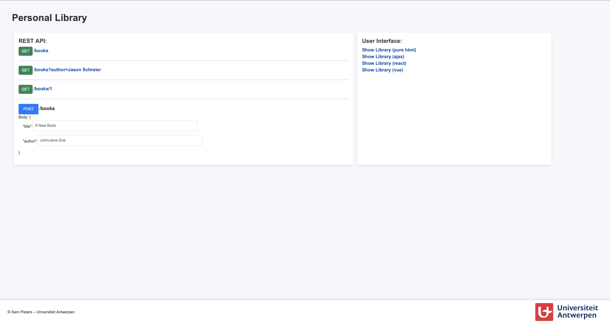

# Quick Start

## Creating the database

**1) Install dependencies** 
```bash
sudo apt install postgresql
```
**2) Create the database** 

First configure the database with ``postgres`` user:
```bash
sudo su postgres
```

Connect to postgres
```bash
psql
```

Then create a role ``app`` that will create the database and be used by the application:
```postgres
CREATE ROLE app WITH LOGIN CREATEDB;
CREATE DATABASE library OWNER app;
```
You need to ``trust`` the role to be able to login. Add the following line to /etc/postgresql/\<version\>/main/pg_hba.conf (you need root access, version may vary (e.g. 9.6)). **It needs to be the first rule (above local all peer).**
```
# TYPE  DATABASE        USER            ADDRESS                 METHOD

local   library         app                                     trust
```
and restart the service. Then initialize the database:
```bash
sudo systemctl restart postgresql
```

## Run the API locally
**1) Download the project** 
```
git clone https://github.com/sampieters/PPDB-Template.git
```
**2) Create a virtual environment and install the necessary packages** 

```bash
cd PPDB-Template
python3 -m venv venv
source venv/bin/activate
pip install -r requirements.txt
```

**3) Run the development server** 
```bash
cd src
python3 app.py
```
Then visit http://localhost:5000

**4) Result**


